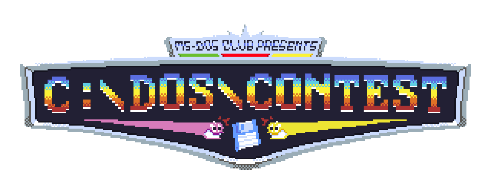

# Juego Concurso MS-DOS Club



## Historia


## Compilar

### DJGPP

```sh
source /usr/local/djgpp/setenv
make
```

### Docker

```sh
docker build . -t build-djgpp
```

```sh
docker run -it --rm -v "${PWD}":/tmp/game build-djgpp
```

## Fuentes

https://lodev.org/cgtutor/raycasting.html

Made with :heart: by [AzazelN28](https://github.com/AzazelN28)
